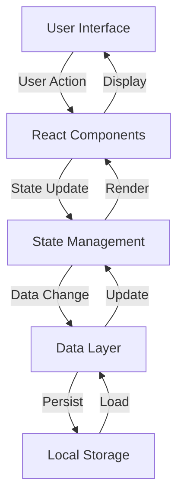

# Data Flow Architecture

## Overview
This document describes how data flows through the Student Points Tracker application, from user interactions to persistence and back.

## Data Flow Diagram

## Components

### User Interface Layer
- React components handle user interactions
- Form inputs and displays
- Real-time updates
- Responsive design

### State Management
- React state for UI components
- Context for global state
- State updates trigger re-renders
- Optimistic updates for better UX

### Data Layer
- Data transformation and validation
- Business logic implementation
- API calls (if applicable)
- Error handling

### Persistence Layer
- Local storage for data persistence
- Data serialization/deserialization
- Backup and recovery mechanisms

## Key Patterns

### Data Updates
1. User triggers action
2. UI updates optimistically
3. Data layer processes change
4. Persistence layer saves
5. Success/failure feedback

### Error Handling
- Graceful degradation
- Error boundaries
- Retry mechanisms
- User feedback

### Performance Considerations
- Debounced updates
- Batched state changes
- Lazy loading
- Caching strategies

## Related Concepts
- [State Management](./arch-state-management.md)
- [Data Persistence](./arch-data-persistence.md)
- [Error Handling](./arch-error-handling.md)

## AI Notes
- Consider implementing data validation middleware
- Add data migration capabilities
- Implement data versioning
- Add data integrity checks
- Consider adding data export/import features

## Last Updated
2024-04-01

## References
- `src/context/AppContext.tsx`
- `src/utils/storage.ts`
- `src/hooks/useData.ts` 